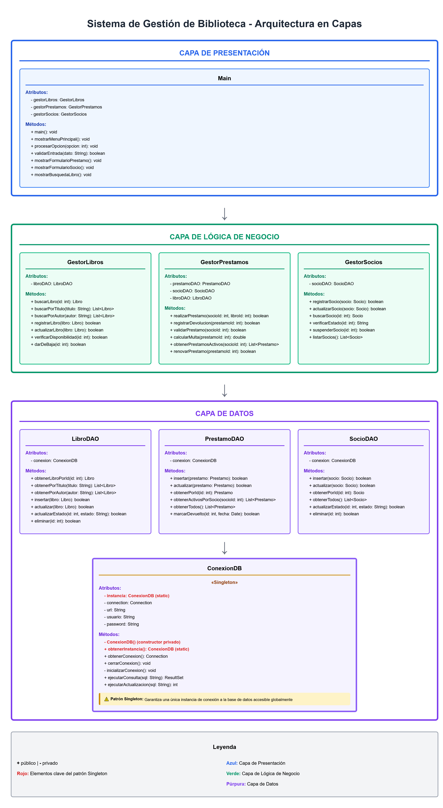

# Sistema de Gestión de Biblioteca 📚

Trabajo Práctico – Unidad 3: Diseño Arquitectónico  
**Materia:** Ingeniería de Software II  
**Profesor:** Víctor Hugo Contreras  
**Autor:** Alejo Ezequiel Escurra

---

## 📋 Descripción del Proyecto

Sistema de gestión de biblioteca desarrollado con arquitectura en capas que permite administrar libros, socios y préstamos. El proyecto implementa patrones de diseño y buenas prácticas de ingeniería de software.

### Funcionalidades Principales

- ✅ Registro y búsqueda de libros
- ✅ Gestión de socios de la biblioteca
- ✅ Registro de préstamos y devoluciones
- ✅ Validación de disponibilidad de libros
- ✅ Cálculo automático de multas por retraso
- ✅ Persistencia de datos en base de datos

---

## 🏗️ Arquitectura en 3 Capas

El sistema implementa una arquitectura en capas que separa las responsabilidades y facilita el mantenimiento:

### 1. **Capa de Presentación**
- **Responsabilidad:** Interfaz de usuario y validación de entradas
- **Componentes:** `Main.java`
- **Función:** Mostrar menús, formularios y capturar acciones del usuario

### 2. **Capa de Lógica de Negocio**
- **Responsabilidad:** Reglas del negocio y validaciones
- **Componentes:** 
  - `GestorLibros.java` - Gestión de libros
  - `GestorPrestamos.java` - Manejo de préstamos y devoluciones
  - `GestorSocios.java` - Administración de socios
- **Función:** Validar préstamos, calcular multas, verificar disponibilidad

### 3. **Capa de Datos**
- **Responsabilidad:** Acceso y persistencia de datos
- **Componentes:** 
  - `ConexionDB.java` - Conexión a base de datos (Singleton)
  - `LibroDAO.java` - Operaciones CRUD de libros
  - `PrestamoDAO.java` - Operaciones CRUD de préstamos
  - `SocioDAO.java` - Operaciones CRUD de socios
- **Función:** Abstraer el acceso a la base de datos mediante el patrón DAO

---

## 🎯 Patrón de Diseño: Singleton

### Problema Identificado
**Acceso centralizado a la Base de Datos**: Es fundamental que la conexión a la base de datos sea única y controlada para evitar:
- ❌ Múltiples conexiones simultáneas
- ❌ Sobrecarga de recursos
- ❌ Inconsistencias en las transacciones

### Solución: Patrón Singleton
El patrón **Singleton** garantiza que la clase `ConexionDB` tenga una única instancia durante toda la ejecución del programa.

#### Implementación
```java
public class ConexionDB {
    private static ConexionDB instancia;  // Única instancia
    private Connection connection;
    
    // Constructor privado - evita instanciación externa
    private ConexionDB() {
        // Inicializar conexión
    }
    
    // Método estático para obtener la única instancia
    public static ConexionDB obtenerInstancia() {
        if (instancia == null) {
            instancia = new ConexionDB();
        }
        return instancia;
    }
}
```

#### Ventajas
- ✅ Una única conexión a la base de datos
- ✅ Acceso global y controlado
- ✅ Optimización de recursos
- ✅ Facilita el mantenimiento

---

## 📂 Estructura del Proyecto

```
biblioteca-gestion/
├── src/
│   ├── presentacion/
│   │   └── Main.java
│   │
│   ├── negocio/
│   │   ├── GestorLibros.java
│   │   ├── GestorPrestamos.java
│   │   └── GestorSocios.java
│   │
│   ├── datos/
│   │   ├── ConexionDB.java       (Singleton)
│   │   ├── LibroDAO.java
│   │   ├── PrestamoDAO.java
│   │   └── SocioDAO.java
│   │
│   └── modelos/
│       ├── Libro.java
│       ├── Prestamo.java
│       └── Socio.java
│
├── uml/
│   └── diagrama_uml_biblioteca.png
│
├── docs/
│   └── informe.pdf
│
└── README.md
```

---

## 📊 Diagrama UML

El diagrama UML completo del sistema se encuentra en la carpeta `/uml`:



El diagrama muestra:
- Las tres capas del sistema
- Clases con atributos y métodos
- Relaciones entre las capas
- Implementación del patrón Singleton

---

## ▶️ Ejecución

### Opción 1: Desde consola
```bash
cd src
javac presentacion/Main.java
java presentacion.Main
```

### Opción 2: Desde IDE
1. Abrir el proyecto en tu IDE (Eclipse, IntelliJ, NetBeans)
2. Ejecutar la clase `Main.java`

---

## 📖 Uso del Sistema

### Menú Principal
```
=== SISTEMA DE GESTIÓN DE BIBLIOTECA ===
1. Gestión de Libros
2. Gestión de Socios
3. Gestión de Préstamos
4. Salir
```

### Ejemplos de Operaciones

**Registrar un préstamo:**
1. Seleccionar "Gestión de Préstamos"
2. Ingresar ID del socio
3. Ingresar ID del libro
4. El sistema valida disponibilidad y registra el préstamo

**Buscar un libro:**
1. Seleccionar "Gestión de Libros"
2. Elegir búsqueda por título o autor
3. Ver resultados disponibles

---

## 🎓 Justificación del Diseño

### ¿Por qué Arquitectura en Capas?
- **Separación de responsabilidades:** Cada capa tiene una función específica
- **Mantenibilidad:** Los cambios en una capa no afectan a las demás
- **Escalabilidad:** Facilita agregar nuevas funcionalidades
- **Testabilidad:** Cada capa puede ser probada independientemente

### ¿Por qué el Patrón Singleton?
- **Control de recursos:** Evita múltiples conexiones a la BD
- **Consistencia:** Garantiza que todos los DAOs usen la misma conexión
- **Eficiencia:** Reduce el overhead de crear múltiples conexiones

---

## 📝 Documentación Adicional

Para más información sobre el diseño y decisiones arquitectónicas, consultar:
- [Informe del Trabajo Práctico](docs/Informe - Sistema de Gestión de Biblioteca.pdf)
- [Diagrama UML](uml/diagrama_uml_biblioteca.png)

---

## 🤝 Contribuciones

Este proyecto es parte de un trabajo práctico académico. No se aceptan contribuciones externas.

---

## 📄 Licencia

Este proyecto es de uso académico - Universidad Nacional de José C. Paz

---

## ✨ Autor

**Alejo Ezequiel Escurra**  
Ingeniería de Software II  

---

## 📚 Referencias

- Gamma, E., Helm, R., Johnson, R., & Vlissides, J. (1994). *Design Patterns: Elements of Reusable Object-Oriented Software*
- Fowler, M. (2002). *Patterns of Enterprise Application Architecture*
- Documentación oficial de Java: [docs.oracle.com/javase](https://docs.oracle.com/javase/)

---

*Trabajo Práctico desarrollado para la materia Ingeniería de Software II*
